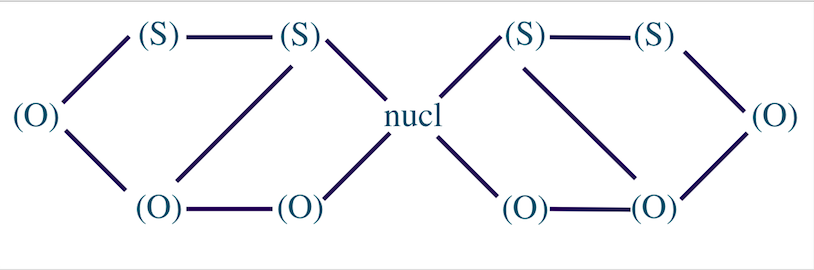
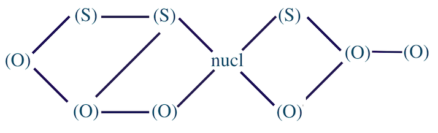

```{r setup, include=FALSE}
knitr::opts_chunk$set(echo = FALSE, message = FALSE)
library(tidyverse)
library(kableExtra)
```

## Македонский язык  

< Macedo-Bulgarian < Eastern South Slavic < South Slavic < Slavic < Balto-Slavic < Indo-European  

## Фонетическая система: согласные  

| Место образования  | Губно-губные | Губно-зубные | Зубные        | Альвеолярные | Альвео-палатальные | Палатальные | Велярные    |
|--------------------|--------------|--------------|---------------|--------------|--------------------|-------------|-------------|
| Способ образования |              |              |               |              |                    |             |             |
| Взрывные           | p *⟨п⟩* b *⟨б⟩*  |              | t *⟨т⟩* d *⟨д⟩*   |              |                    | c *⟨ќ⟩* ɟ *⟨ѓ⟩* | k *⟨к⟩* ɡ *⟨г⟩* |
| Щелевые            |              | f *⟨ф⟩* v *⟨в⟩*  | s *⟨с⟩* z *⟨з⟩*   |              | ʃ *⟨ш⟩* ʒ *⟨ж⟩*        |             | x *⟨х⟩*       |
| Аффрикаты          |              |              | t̪͡s̪ *⟨ц⟩* d̪͡z̪ *⟨ѕ⟩* |              | t͡ʃ *⟨ч⟩* d͡ʒ *⟨џ⟩*      |             |             |
| Глайды             |              |              |               |              |                    |      j *⟨й⟩*  |             |
| Боковые            |              |              |      l *⟨л⟩*    |              |                    |             |             |
| Носовые            | m *⟨м⟩*        |              |      n *⟨н⟩*    |              |                    |      ɲ *⟨њ⟩*  |             |
| Дрожащие           |              |              |               |      r *⟨р⟩*   |                    |             |             |

*таблица 1. Консонантная система македонского языка*   

## Фонетическая система: гласные 

| Ряд     | Передний     | Средний      | Задний     |
|---------|--------------|--------------|------------|
| Подъём  | Неогубленные | Неогубленные | Огубленные |
| Верхний | i *⟨и⟩*        |              | u *⟨у⟩*      |
| Средний | ɛ *⟨е⟩*        | (ə)          | ɔ *⟨о⟩*      |
| Нижний  |              | a *⟨а⟩*        |            |

*таблица 2. Вокалическая система македонского языка*   

## Описание фонотактической структуры 

инициаль — ядро — финаль

* инициаль — согласные, предшествующие ядру  
* финаль — согласные, следующие за ядром 
* ядро — вершина слога 

## Методы определения принципов слогоделения 

**Экспериментально** [@cote2010]:  

*	**Вставка паузы** *(Pause Insertion)*: ко-[пауза]-шка, кош-[пауза]-ка;  
*	**Перестановка слогов** *(Syllable Reversal/Permutation)*: шка-ко, ка-кош;  
*	**Редупликация слога** *(Syllable Reduplication)*: ко-ко-шка, кош-кош-ка;  
*	**Повторение n-ого слога** *(Syllable Repetition)*: кошка-ко, кошка-кош;  
*	**Замена слога на другим** *(Syllable Substitution)*: кошка > бушка (замена слога ко-), бука (замена слога кош-);  
*	**Вставка другого элемента** *(Fragment Insertion)*: кошка ⇒ ‘я говорю *ко* и затем *шка*’ 

**Элицитация** [@duanmu2009] 

## Методология 

Частичная автоматизации анализа слоговой структуры [@czerniak2015], [@moroz2019] 

Для македонского языка было размечено 53468 слов  
  - из рассмотрения были исключены: сокращения, сложные слова, междометия 

## Методология (1)

1. На основании грамматического описания [@friedman2002macedonian] выделены единицы, которые могут составлять ядро слога: 

  * гласные 
  * слоговые: 
    - р в начале слова перед согласным: *рж* 
    - р в позиции между двумя согласными: *грст* 
    - р, л, н в конце слова после согласного: *тембр*, *шатл*, *ансамбл*, *артикл*, *бинокл*, *њутн*

## Методология (2)

В упрощёном виде:

- S (sonorant) 
    * r, l, m, n, j, lj, nj 
- O (obstruent) 
    * p, b, v, f, t, d, ts, dz, s, z, tʃ, dʒ, ʃ, ʒ, c, ɟ, k, ɡ, x
- V (vocalic) 
    * всё, что может быть вершиной слога: a, o, u, e, i, L, N, R

    
2. На основе всего имеющегося лексического материала выделены: 

 - все возможные инициали первых слогов слов 
 - все возможные финали последних слогов слов 

## Инициали 

```{r q_initials_f, echo = FALSE}
q_initials_f <- read_tsv("quality_initials_frequency.tsv", col_names = TRUE)
DT::datatable(q_initials_f)
```

## Инициали: *O-O-O-S* — исключение 

  - **встр**ана 
  
  - **вшпр**ица 

## Финали 

```{r q_finals_f, echo = FALSE}
q_finals_f <- read_tsv("quality_finals_frequency.tsv", col_names = TRUE)
DT::datatable(q_finals_f)
```

## Методология (3)

3. На основе полученных данных составлена общая модель слога 



## Методология (4) 

4. Тестирование полученной модель на всём материале: 

+ проверка на интервокальных кластерах 

**Если** обнаруживаются слова, в которых интервокальные кластеры нельзя объяснить полученной моделью 

  => уточнение модели с учётом "исключений" 

## Анализ кластеров согласных  

модель описывает все слова: 

```{r predictions, echo = FALSE}
predictions <- read_tsv("preds.tsv", col_names = TRUE)
DT::datatable(predictions)
```

## Методология (5) 

5. Составлен список всех возможных комбинаций выделенных инициалей и финалей 

[?] порождает ли модель какие-то кластеры которые не были бы представлены в языке 

## Комбинации кластеров  

```{r syllables_pr, echo = FALSE}
syllables_pr <- read_tsv("syllables_in_words.tsv", col_names = TRUE)
DT::datatable(syllables_pr)
```

## Методология (5): да, перепорождает 

слоги которые она перепорождает 

OSSVOOO	 
SSVSSO  
OSSVSSO  
OOSVSSO  
OOOVSSO  

5,88% слогов 

## Методология (5): упрощение модели, ограничения 

OSS V OOO	 
SS  V SSO  
OSS V SSO  
OOS V SSO  
OOO V SSO  

S-S-O: аjнц 

OOS V OOO: здравствен, здравство 

## Интервокальные кластеры: волновой характер слога 

Разные типы языков [@kodzasov1980]: 

* "квантовые" языки 
    - слог характеризуется пограничными сигналами, которые маркируют его границы 
* "волновые" языки
    - границы слога не маркируются 
    - ко-шка vs кош-ка [@knyazev1999]

## Интервокальные кластеры: строгие фонотактические правила  

для македонского языка неизвестны строгие фонотактические правила 

Язык гуро [@vydrin2008]: 

 * V, CV, CVV, CVV2, CVLV, CVlV2

<<<<<<< HEAD
Теория сонорности [@clements1990] предсказывает распределение разных типов сегментов относительно ядра. 
=======
## можно поговорить про вероятности 

очевидно что они все неравномерно распределены 

7. (Факультативно) проверить распределение разных типов слогов в разных позициях слова, выяснить, не наблюдается ли тяготение некоторых типов слогов к позиции в конце, в начале или в середине слова.
[@moroz2019] 

=======
не все из этих комбинаций представлены в словах ВСТРЕЧАЮТСЯ НЕ ВСЕ КОМБИНАЦИИ 

## про интервокальные кластеры: мы на них не смотрим потому 

мы не можем определить точную границу слога для македонского языка 

(1) **про волновой характер слога**: (Кадзасов и Муравьёва — посм у ГМ в статье ссылку [@kodzasov1980]) 

"волновой" характер слога ("В волновых языках носители затрудняются определить
границу слогов, в результате чего можно наблюдать вариативность в слогоделении") 

(2) **и точных фонотактических правил нам неизвестно** (как в Африке) 

это некоторое предположение про македонский язык  
но вообще есть языки с более строгими фонотактическими правилами, например:  


*в книжке у меня про язык вроде языка фула: слог всегда открытый, всё что есть в интервокале — всегда "инициаль"* 

*можно состлаться на какую-нибуль статью Выдрина про, напр, стопы: набор того что бывает в начале != тому что бывает в интервокале*

но мы считаем что македонский не из их числа 

(3) **про теорию сонорности** 

она не работает: где — везде (и в начальных и конечных кластерах всех слов и в интервокале) 

примеры из македонского, можно вообще из какого-нибудь любого (twelfth's) 


## можно поговорить про вероятности 

очевидно что они все неравномерно распределены 

7. (Факультативно) проверить распределение разных типов слогов в разных позициях слова, выяснить, не наблюдается ли тяготение некоторых типов слогов к позиции в конце, в начале или в середине слова.
[@moroz2019] 

## Данные (лексический материал) 

* было размечено 53468 слов  
  из рассмотрения были исключены: сокращения, сложные слова, междометия 
* на основании анализа инициалей и финалей всех слов составлена модель (СХЕМА МОДЕЛИ) 
* из модели видно, что шумный не может быть ближе к ядру чем сонорный 

## ПРО ЧТО НУЖНО СКАЗАТЬ 

[x] что решено про слоговые 
[ ] данные на материале которых 
[ ] вся работа сразу на многосложных словах — и так понятно что может быть ядром (?поэтому) 
<<<<<<< HEAD

минус 5 слайдов 
=======

## 

```{r}
kable(read_csv("../all_possible_clusters.csv")) %>%
  kable_styling(bootstrap_options = "striped", full_width = F)
```

## Intro

This is an R Markdown presentation. Markdown is a simple formatting syntax for authoring HTML, PDF, and MS Word documents. For more details on using R Markdown see <http://rmarkdown.rstudio.com>.


## Slide with R Output

```{r cars, echo = FALSE}
DT::datatable(cars)
```

## Slide with Plot

```{r pressure}
plot(pressure)
```

## Slide with bibliography
>>>>>>> origin/master

## Модель: упрощение 



## Некоторая литература  
